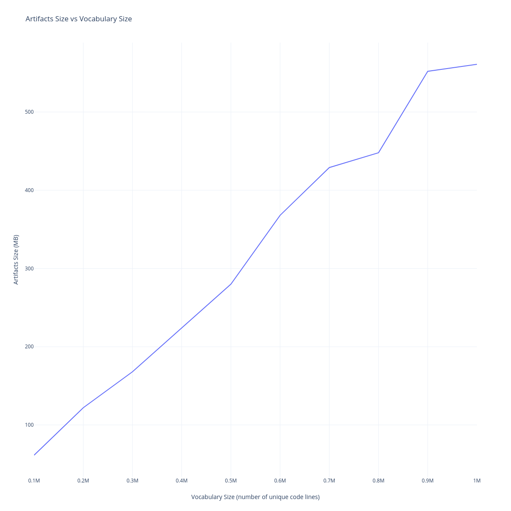
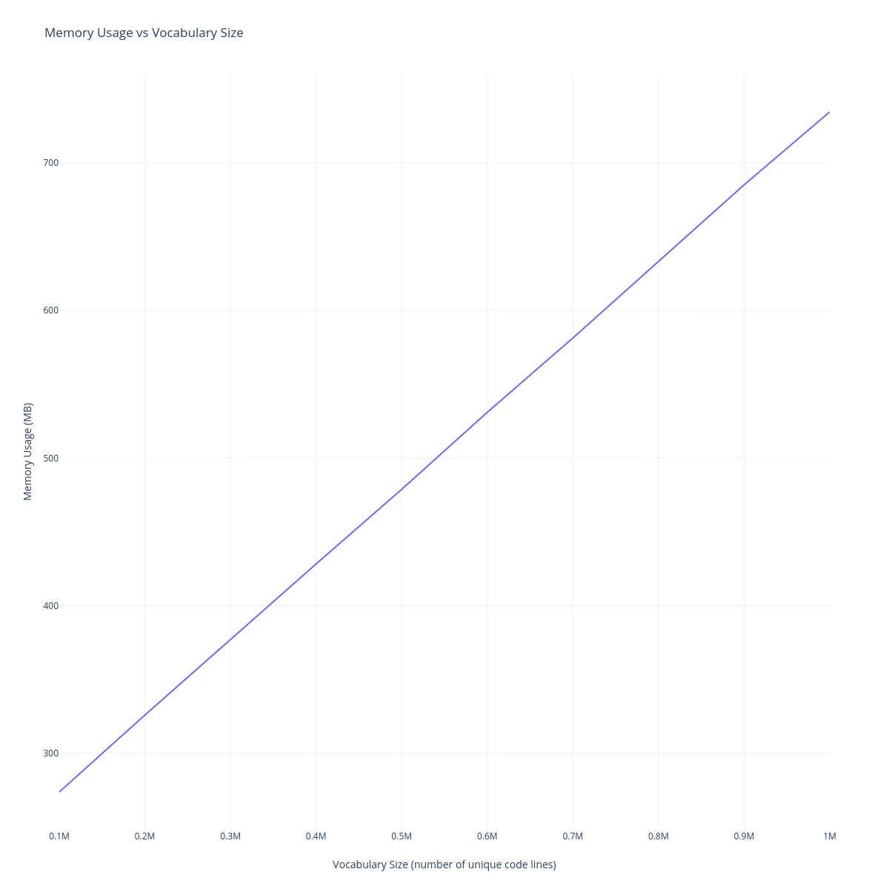
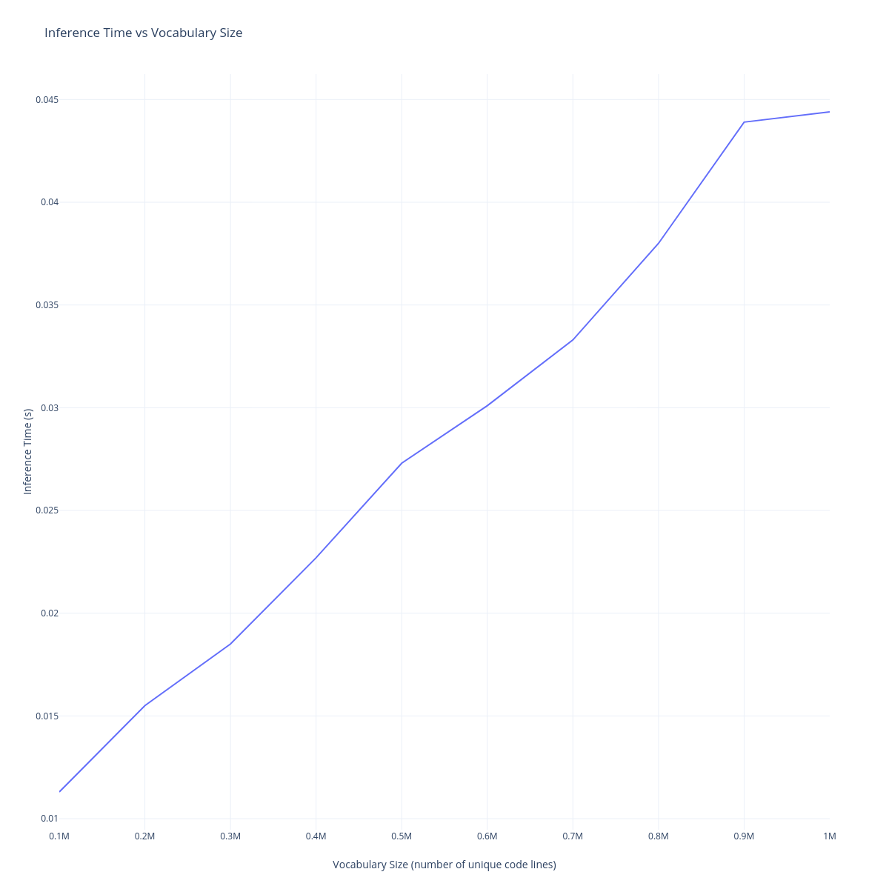

#### gpt2-medium model (Fine-tuned on Python Algorithms dataset)
```
model size: 1.44 GB   
avg inference time: 8 seconds 
avg memory usage: 1800 MB 
```

#### GraphSense (trained on Python Algorithms dataset)
```  
model size: 13.9 MB
avg inference time: 0.0079 seconds 
avg memory usage: 277.8194 MB 
``` 

#### accuracy of gpt2-medium model
```
top-1 accuracy =  0.3694327048114434
top-3 accuracy =  0.6660029258777633
top-10 accuracy =  0.7574772431729518
```

#### accuracy of GraphSense (vector size: 128)
| Epochs | Walks | Length | Window | Top-1 Accuracy | Top-3 Accuracy | Top-10 Accuracy |
|--------|-------|--------|--------|----------------|----------------|-----------------|
| 1      | 10    | 10     | 5      | 0.3694         | 0.6660         | 0.7575          |
| 10     | 10    | 10     | 5      | 0.4182         | 0.7706         | 0.8894          |
| **100**| **10**| **10** | **5**  | **0.4718**     | **0.8012**     | **0.8958**      |
| 100    | 100   | 10     | 5      | 0.4371         | 0.7299         | 0.8279          |
| 1000   | 10    | 10     | 5      | 0.4847         | 0.7960         | 0.8926          |
| 100    | 20    | 20     | 3      | 0.4334         | 0.7288         | 0.8482          |
| 100    | 20    | 20     | 10     | 0.4521         | 0.7607         | 0.8717          |


#### scalability of GraphSense (vector size: 128)
```
vocabulary = 100,000
average memory usage: 273.777 MB
average execution time: 0.0113 seconds
artifacts size: 61.3 MB

vocabulary = 200,000
average memory usage: 325.8949 MB
average execution time: 0.0155 seconds
artifacts size: 122 MB

vocabulary = 300,000
average memory usage: 377.1085 MB
average execution time: 0.0185 seconds
artifacts size: 168 MB

vocabulary = 400,000
average memory usage: 428.3011 MB
average execution time: 0.0227 seconds
artifacts size: 224 MB

vocabulary = 500,000
average memory usage: 478.8532 MB
average execution time: 0.0273 seconds
artifacts size: 280 MB

vocabulary = 600,000
average memory usage: 531.0189 MB
average execution time: 0.0301 seconds
artifacts size: 368 MB

vocabulary = 700,000
average memory usage: 581.3494 MB
average execution time: 0.0333 seconds
artifacts size: 429 MB

vocabulary = 800,000
average memory usage: 633.226 MB
average execution time: 0.038 seconds
artifacts size: 448 MB

vocabulary = 900,000
average memory usage: 685.1932 MB
average execution time: 0.0439 seconds
artifacts size: 552 MB

vocabulary = 1,000,000
average memory usage: 734.5819 MB
average execution time: 0.0444 seconds
artifacts size: 561 MB
```

#### Linear Scaling

  
  
  